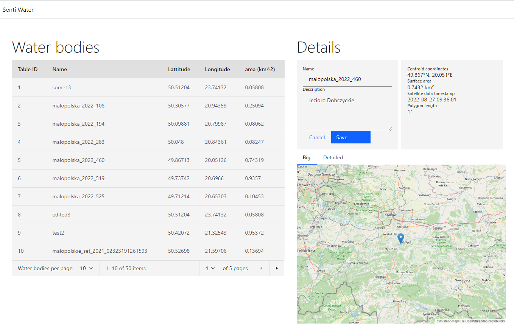
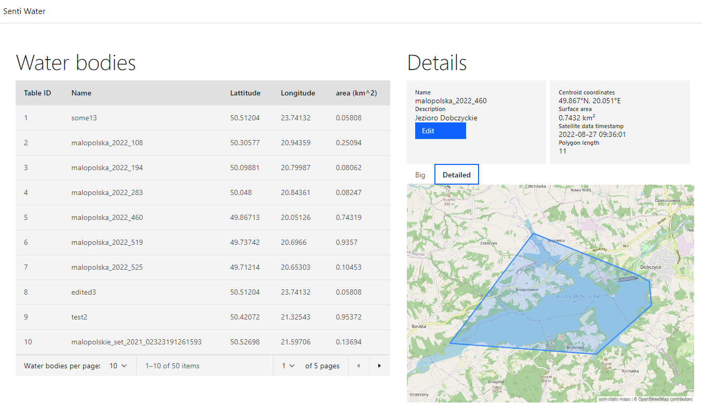

# Senti Water UI

It is a Simple React application that shows data from [our project](https://github.com/rafalgrm/senti-water)<br>
Technologies: React + Typescript + Next.js

## Getting Started

Install packages:
```bash
npm install
# or
yarn install
```

Create a ```ibm-credentials.env``` file in the root of this repository with the following variables:
```
CLOUDANT_SENTI_APIKEY=[your APIKEY]
CLOUDANT_SENTI_URL=[your URL]
```

Run the development server:
```bash
npm run dev
# or
yarn dev
```

Open [http://localhost:3000/waters](http://localhost:3000/waters) with your browser to see the result.

## Screenshots

<br>
